# Algorithms 2 Project: Zombie AI

# The final result:

<table> <tr> <td>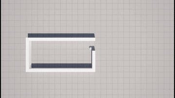</td> <td>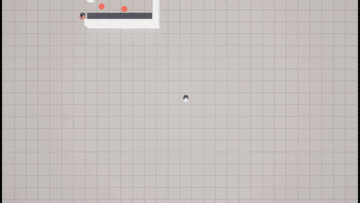</td> </tr> </table> 
 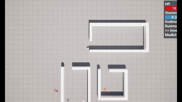 

---

# Explaination:

## Decision Making
 
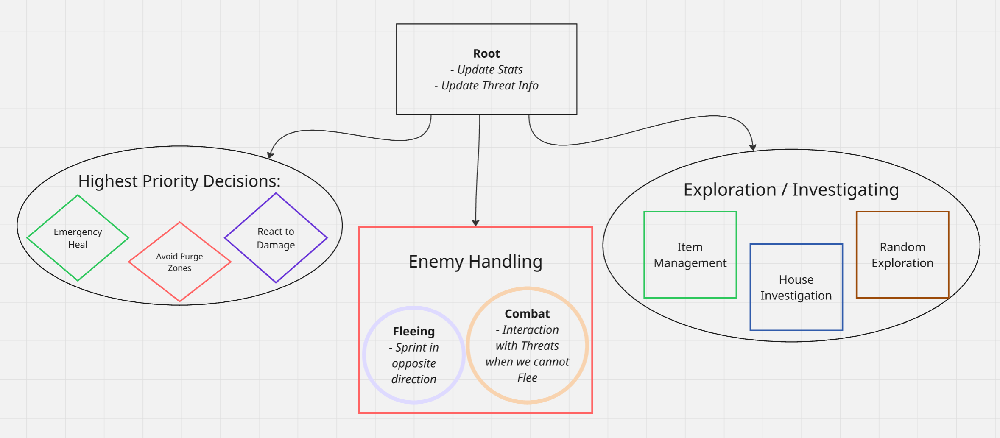   

---
 
## Enemy Handling
 

 
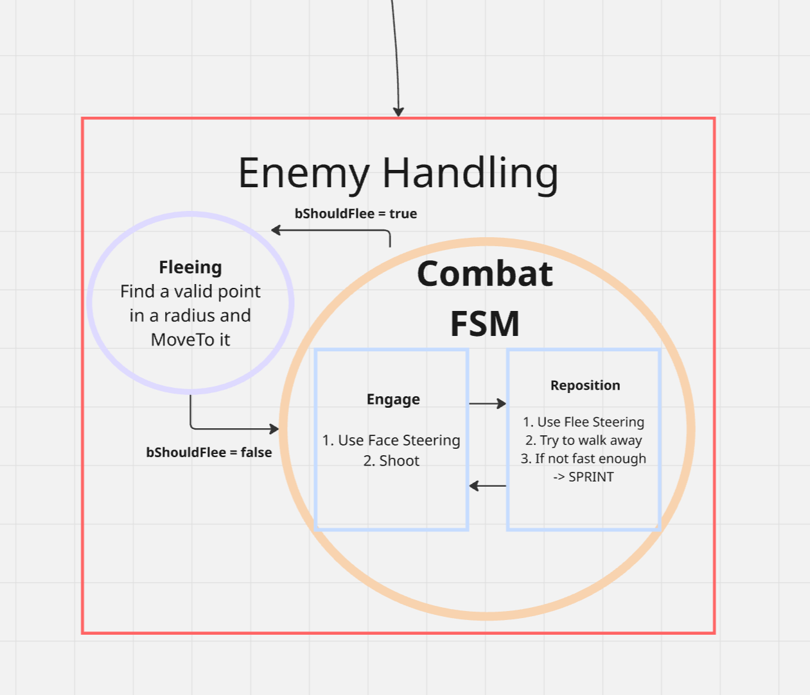
 
**Assess Threat (Service)** - the glue
 
*Manages the transition between FLEE and COMBAT by setting the bShouldFlee flag*
 
Information needed to set the **bShouldFlee** flag:
- Threat Actor
- Threat Speed
- Threats Count
- Health/Stamina

---

## Enemy Handling - Fleeing and Combat
 
### Fleeing
 
Uses NavMesh MoveTo
 
*The conditions to FLEE:*
1. No weapon / no ammo on weapon
2. Health too low
3. Too many Threats nearby

### Combat

Uses Face and Flee Steering Behaviors

*FSM is the perfect fit for Face and Fire / Back off when cornered / Re-aim when zombie moves*

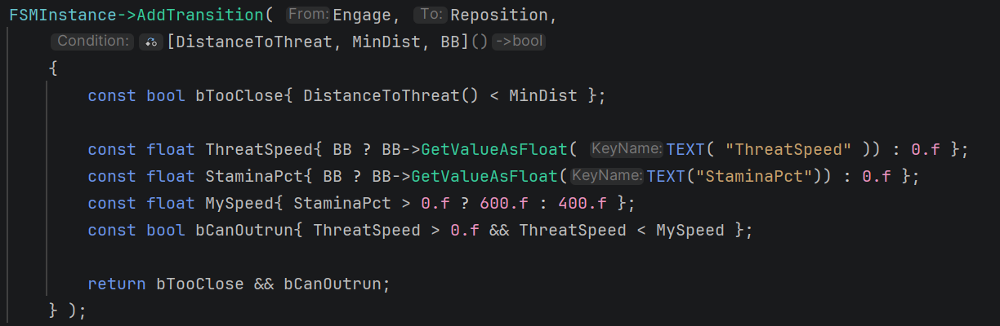

FSM is Built and Started in the Combat Task Enter.
FSM is Ticked in Combat Task Tick.
FSM is stopped in Combat Task Abort and End.

---

Combat States are assigned Transitions which constantly check the distance between Survivor and Threat.

---

## Inventory

### Looting

Memory

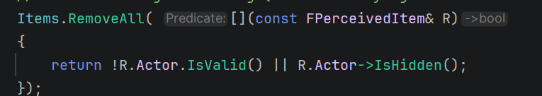

Priority

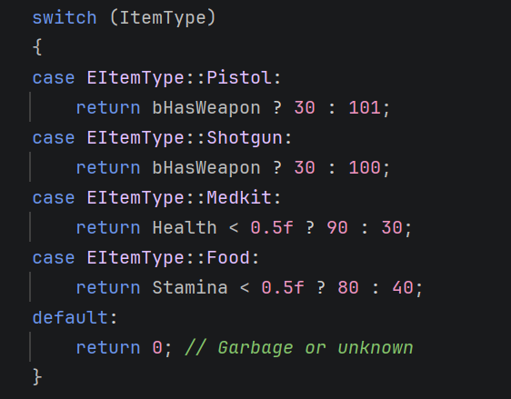

### Using/Dropping an Item

- Eat Food when Stamina ≤ 0.3
- Use Medkit when Health ≤ 0.3

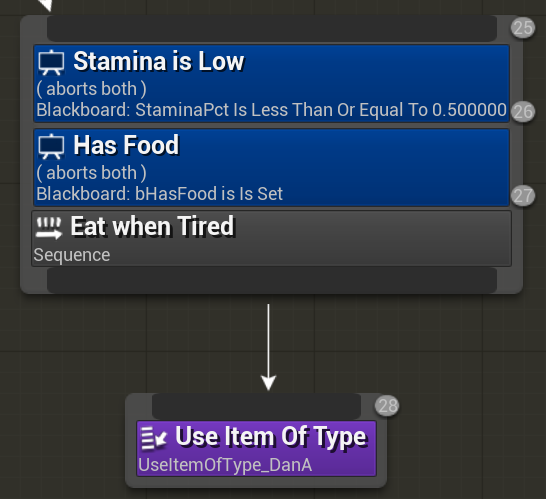
 
Drop used Items
 
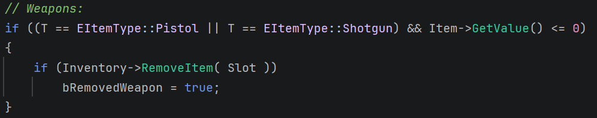
 
---

## Movement - Steering
 
1. **Combat**
   - Uses Face Steering for Engage
   - Uses Flee Steering for Reposition
2. **Reacting to Damage**
   - "Scans" by rotating around itself
3. **Fleeing is interesting**
   - FINDS a flee point by selecting "Best one" in a radius
   - Furthest point from TargetThreat(Zombie) Actor
4. **Fleeing from Purge Zone**
   - Reuses same logic - runs away from PurgeToAvoid Actor

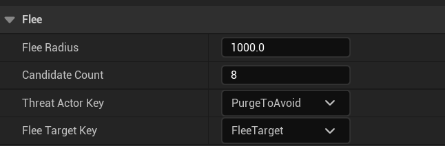

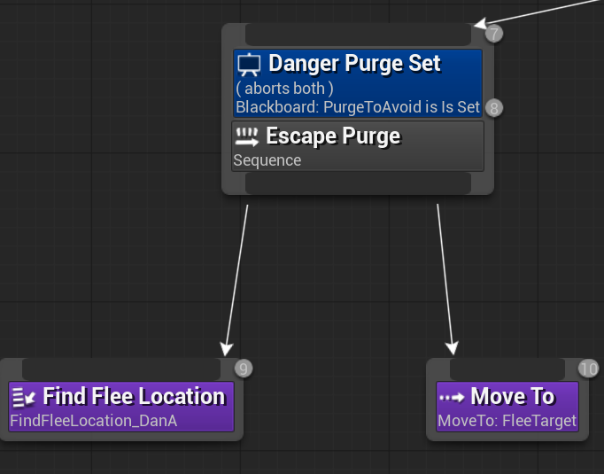

---

## Movement - Exploration

### Investigating a House

*Why Investigate a House?*
- Push a House to the Array of remembered houses
- But more importantly, push Items to the Array of remembered items
*What does Refresh World Memory do?*
1. Removes old/stagnant memory for zombies, items and houses
2. Updates Houses visited flag
3. Writes to Blackboard
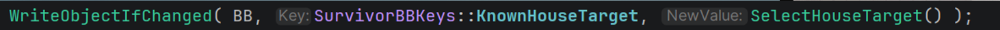

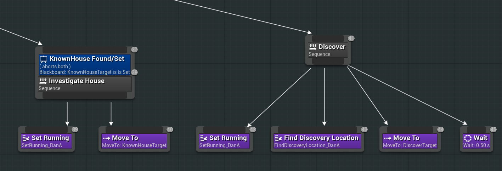

### Discovering (Lowest Priority)

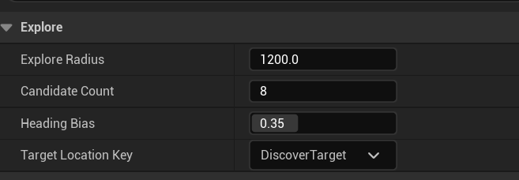